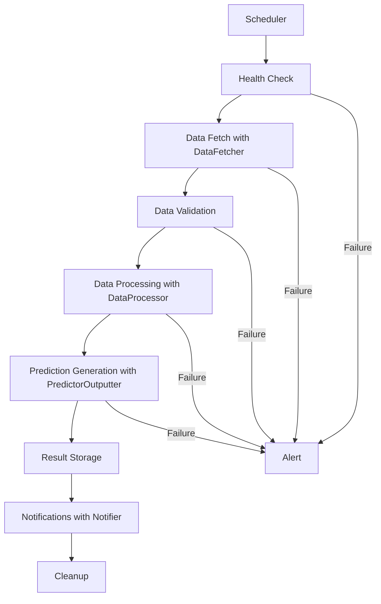

# FormFinder Architecture Documentation

This document provides a comprehensive overview of the FormFinder 2.0 architecture, design decisions, and implementation details.

## Table of Contents

1. [Overview](#overview)
2. [Architecture Principles](#architecture-principles)
3. [System Components](#system-components)
4. [Data Flow](#data-flow)
5. [Database Design](#database-design)
6. [Workflow Orchestration](#workflow-orchestration)
7. [Configuration Management](#configuration-management)
8. [Testing Strategy](#testing-strategy)
9. [Deployment Architecture](#deployment-architecture)
10. [Monitoring and Observability](#monitoring-and-observability)
11. [Security Considerations](#security-considerations)
12. [Performance Optimization](#performance-optimization)
13. [Future Enhancements](#future-enhancements)

## Overview

FormFinder 2.0 represents a complete architectural overhaul from a simple script-based system to a robust, production-ready data pipeline. The system is designed to fetch, process, and analyze football data to generate predictions with high reliability and scalability.

### Key Improvements

- **Database Storage**: Replaced CSV files with SQLAlchemy-based database models
- **Workflow Orchestration**: Implemented Prefect-based pipeline management
- **Centralized Configuration**: Unified YAML-based configuration with Pydantic validation
- **Comprehensive Testing**: Full test suite with unit, integration, and performance tests
- **CI/CD Pipeline**: Automated testing, linting, and deployment
- **Containerization**: Docker support for consistent deployment
- **Monitoring**: Integrated health checks and metrics collection

## Architecture Principles

### 1. Separation of Concerns
- **Data Layer**: Database models and data access logic
- **Business Logic**: Data processing and prediction algorithms
- **Orchestration Layer**: Workflow management and scheduling
- **Presentation Layer**: CLI interface and notifications

### 2. Configuration-Driven Design
- All system behavior controlled through configuration
- Environment-specific overrides
- Runtime validation of configuration values

### 3. Testability
- Dependency injection for external services
- Mock-friendly interfaces
- Comprehensive test coverage

### 4. Observability
- Structured logging throughout the system
- Health checks and metrics
- Error tracking and alerting

### 5. Scalability
- Horizontal scaling through containerization
- Database connection pooling
- Async processing capabilities

## System Components

### Core Modules

```
formfinder/
├── __init__.py          # Package initialization
├── config.py            # Configuration management
├── database.py          # Database models and management
├── DataFetcher.py       # External API integration and data fetching
├── DataProcessor.py     # Data processing logic
├── PredictorOutputter.py# Prediction algorithms and output generation
├── notifier.py          # Alert and notification system
├── workflows.py         # Prefect workflow definitions
├── cli.py              # Command-line interface
└── utils.py            # Utility functions
```

### Configuration System

```python
# Hierarchical configuration with validation
class DataFetcherConfig(BaseModel):
    api: APIConfig
    processing: ProcessingConfig

class APIConfig(BaseModel):
    api_key: str
    base_url: str
    rate_limit: int

class ProcessingConfig(BaseModel):
    batch_size: int
    max_workers: int

class FormFinderConfig(BaseModel):
    api: APIConfig
    database: DatabaseConfig
    processing: ProcessingConfig
    notifications: NotificationConfig
    logging: LoggingConfig
    workflows: WorkflowConfig
    monitoring: MonitoringConfig
```

### Database Layer

```python
# SQLAlchemy models with relationships
class League(Base):
    id: int
    name: str
    country: str
    teams: List[Team]
    fixtures: List[Fixture]

class Team(Base):
    id: int
    name: str
    league_id: int
    standings: List[Standing]
    home_fixtures: List[Fixture]
    away_fixtures: List[Fixture]
```

## Data Flow

### 1. Data Ingestion
```
DataFetcher → Rate Limiter → Data Validator → Database Writer
```

### 2. Data Processing
```
Database Reader → DataProcessor → Form Calculator → Statistics Generator
```

### 3. Output Generation
```
Prediction Results → PredictorOutputter → Formatter → Notifier
```

### Workflow Pipeline



## Database Design

### Entity Relationship Diagram

```
League (1) -----> (N) Team
League (1) -----> (N) Fixture
Team (1) -------> (N) Standing
Team (1) -------> (N) Fixture (home)
Team (1) -------> (N) Fixture (away)
Fixture (1) ----> (N) Prediction
System (1) -----> (N) DataFetchLog
```

### Key Design Decisions

1. **Normalized Schema**: Reduces data redundancy and ensures consistency
2. **Foreign Key Constraints**: Maintains referential integrity
3. **Indexes**: Optimized for common query patterns
4. **Audit Trail**: DataFetchLog tracks all data operations
5. **Flexible Predictions**: JSON field for extensible prediction data

### Database Migrations

```python
# Alembic-based migrations for schema evolution
class DatabaseManager:
    def create_tables(self) -> None
    def drop_tables(self) -> None
    def migrate(self) -> None
    def get_status(self) -> Dict[str, Any]
```

## Workflow Orchestration

### Prefect Integration

```python
@task(retries=3, retry_delay_seconds=30)
def fetch_league_data(league_id: int) -> Dict[str, Any]:
    """Fetch data for a specific league with automatic retries."""
    
@flow(name="FormFinder Data Pipeline")
def run_main_pipeline(config_path: str = "config.yaml") -> dict:
    """Main data processing pipeline."""
```

### Task Dependencies

```
Health Check → Data Fetch → Data Validation → Processing → Predictions → Notifications
     ↓              ↓              ↓              ↓            ↓
   Alerts        Retries      Error Handling   Logging    Cleanup
```

### Scheduling

- **Main Pipeline**: Daily at 6 AM UTC
- **Quick Updates**: Every 4 hours
- **Health Checks**: Every 15 minutes
- **Cleanup Tasks**: Weekly

## Configuration Management

### Configuration Hierarchy

1. **Default Values**: Built into Pydantic models
2. **Configuration File**: `config.yaml`
3. **Environment Variables**: Override file values
4. **Runtime Parameters**: Command-line arguments

### Environment Variable Substitution

```yaml
database:
  postgresql:
    host: "${DATABASE_HOST:localhost}"
    password: "${DATABASE_PASSWORD:required}"
```

### Validation

```python
class APIConfig(BaseModel):
    token: str = Field(..., min_length=32)
    base_url: HttpUrl = "https://api.football-data.org/v4"
    timeout: int = Field(30, ge=1, le=300)
    rate_limit: int = Field(10, ge=1, le=100)
```

## Testing Strategy

### Test Pyramid

```
    Integration Tests (20%)
         ↗
    Unit Tests (70%)
         ↗
    End-to-End Tests (10%)
```

### Test Categories

1. **Unit Tests**: Individual component testing
2. **Integration Tests**: Database and API integration
3. **Performance Tests**: Load and benchmark testing
4. **Contract Tests**: API response validation
5. **Security Tests**: Vulnerability scanning

### Test Infrastructure

```python
# Pytest fixtures for test setup
@pytest.fixture
def test_db_session():
    """Provides isolated database session for tests."""
    
@pytest.fixture
def mock_api_responses():
    """Mocks external API calls."""
    
@pytest.fixture
def sample_predictions():
    """Provides test prediction data."""
```

### Continuous Integration

```yaml
# GitHub Actions workflow
steps:
  - Code Quality: black, isort, flake8, mypy
  - Security: bandit, safety
  - Testing: pytest with coverage
  - Performance: benchmark tests
  - Integration: end-to-end pipeline
```

## Deployment Architecture

### Local Development

```
Developer Machine
├── Python Virtual Environment
├── SQLite Database
├── Local Configuration
└── Development Tools
```

### Docker Development

```
Docker Compose
├── FormFinder Application
├── PostgreSQL Database
├── Grafana Dashboard
└── Prometheus Metrics
```

### Production Deployment

```
Kubernetes Cluster
├── FormFinder Pods (Auto-scaling)
├── PostgreSQL (Managed Service)
├── Prefect Cloud
├── Monitoring Stack
└── Load Balancer
```

### Environment Configurations

- **Development**: SQLite, debug logging, mock APIs
- **Staging**: PostgreSQL, info logging, real APIs
- **Production**: PostgreSQL cluster, warning logging, monitoring

## Monitoring and Observability

### Logging Strategy

```python
# Structured logging with context
logger.info(
    "Pipeline completed successfully",
    extra={
        "pipeline_id": pipeline_id,
        "duration_seconds": duration,
        "records_processed": count,
        "predictions_generated": predictions
    }
)
```

### Metrics Collection

- **Business Metrics**: Predictions accuracy, data freshness
- **System Metrics**: CPU, memory, disk usage
- **Application Metrics**: Request rates, error rates, latency
- **Database Metrics**: Connection pool, query performance

### Health Checks

```python
class HealthChecker:
    def check_database_connection(self) -> HealthStatus
    def check_api_connectivity(self) -> HealthStatus
    def check_disk_space(self) -> HealthStatus
    def check_memory_usage(self) -> HealthStatus
```

### Alerting

- **Critical**: Pipeline failures, database connectivity
- **Warning**: High error rates, performance degradation
- **Info**: Successful completions, data quality issues

## Security Considerations

### Data Protection

- **API Keys**: Environment variables, never in code
- **Database Credentials**: Encrypted at rest
- **Network Traffic**: TLS encryption
- **Access Control**: Role-based permissions

### Security Scanning

```bash
# Automated security checks
bandit -r formfinder/          # Code vulnerability scan
safety check                   # Dependency vulnerability scan
trivy image formfinder:latest  # Container image scan
```

### Compliance

- **Data Retention**: Configurable retention policies
- **Audit Logging**: All data access logged
- **Privacy**: No personal data collection
- **GDPR**: Data minimization principles

## Performance Optimization

### Database Optimization

```sql
-- Optimized indexes for common queries
CREATE INDEX idx_fixtures_date ON fixtures(match_date);
CREATE INDEX idx_standings_league ON standings(league_id, season);
CREATE INDEX idx_predictions_confidence ON predictions(confidence DESC);
```

### Caching Strategy

- **Application Cache**: Redis for API responses
- **Database Cache**: Connection pooling
- **HTTP Cache**: ETags for API requests
- **Result Cache**: Prediction results

### Async Processing

```python
# Concurrent data fetching
async def fetch_all_leagues(leagues: List[int]) -> List[Dict]:
    tasks = [fetch_league_data(league_id) for league_id in leagues]
    return await asyncio.gather(*tasks)
```

### Resource Management

- **Memory**: Streaming data processing
- **CPU**: Parallel task execution
- **I/O**: Connection pooling
- **Network**: Request batching

## Future Enhancements

### Short Term (Next 3 months)

1. **Web Interface**: Dashboard for predictions and analytics
2. **Real-time Updates**: WebSocket-based live data
3. **Advanced Analytics**: Machine learning models
4. **Mobile App**: iOS/Android application

### Medium Term (3-6 months)

1. **Multi-tenant Support**: Multiple user accounts
2. **API Gateway**: Public API for predictions
3. **Data Marketplace**: Historical data sales
4. **Social Features**: Community predictions

### Long Term (6+ months)

1. **AI/ML Platform**: Advanced prediction models
2. **Blockchain Integration**: Decentralized predictions
3. **Global Expansion**: Support for all leagues
4. **Enterprise Features**: White-label solutions

### Technical Debt

1. **Performance**: Query optimization
2. **Documentation**: API documentation
3. **Testing**: Increase coverage to 95%+

## Conclusion

FormFinder 2.0 represents a significant evolution from a simple script to a production-ready data pipeline. The architecture emphasizes reliability, scalability, and maintainability while providing a solid foundation for future enhancements.

The modular design allows for independent development and testing of components, while the configuration-driven approach ensures flexibility across different environments. The comprehensive testing strategy and CI/CD pipeline provide confidence in deployments and changes.

This architecture document serves as a living guide for developers working on the system and should be updated as the system evolves.